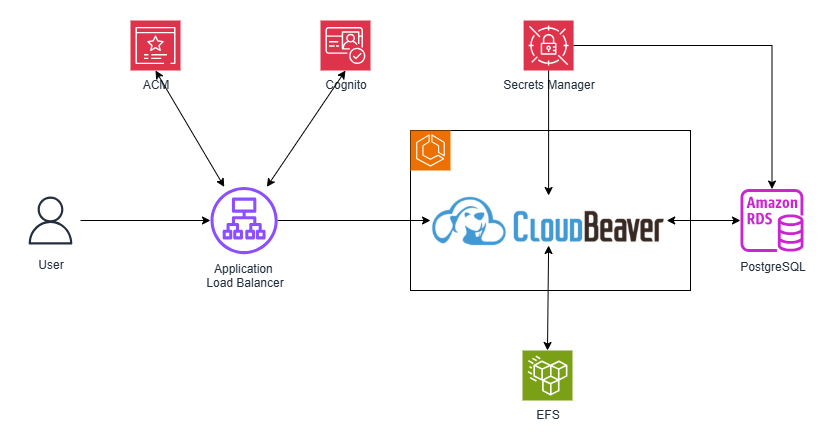
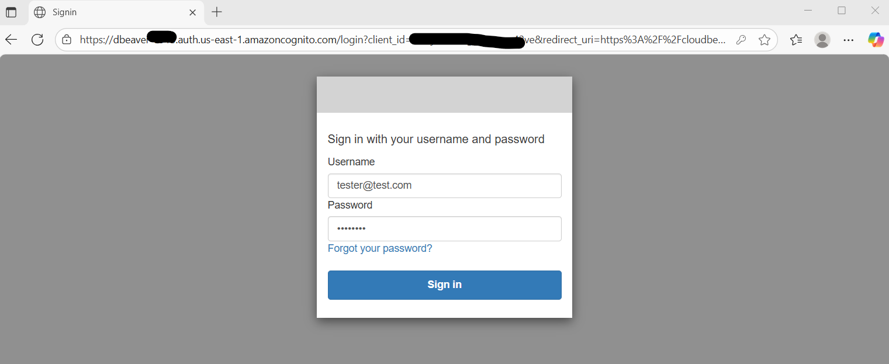

# Run CloudBeaver on AWS ECS
In this project, we deploy [DBeaver CloudBeaver](https://dbeaver.io/) to Amazon ECS.

This example uses the CloudBeaver Community edition.  If you prefer [CloudBeaver Enterprise](https://dbeaver.com/cloudbeaver-enterprise/) edition, please review the specifics on Vendor's website.

## Architecture

## What does this build?
* Creates Secrets Manager entry for database credentials
* Creates an RDS PostgreSQL database for CloudBeaver internal database
* Creates an EFS file system for CloudBeaver internal usage
* Creates ECS Cluster
* Deploys the CloudBeaver container
* Creates a Certificate and Stores in ACM for TLS 
* Creates Application Load Balancer endpoints for the CloudBeaver service

## Steps to run and test
* Run the CDK code and wait for it to finish.  It will print out the CloudBeaver UI endpoint.  
    * Open the UI endpoint. You will get Cognito Loging page. Login using the temporary credentials.
      *  
    * Change your credentials
      *  
    * You are in CLoud Beaver.  Configure the admin.
    * 

`Update 7/16/2025: Added admin credentials to Secrets Manager.  Use that credentials to configure the system.`

## Considerations
* I've used Self-signed certificate.  Use a CA certificate instead.
* I've used ALB directly.  Instead, create R53 domain URL.
* Integrate with an IdP
* Create robust monitoring and logging

## References
* [DBeaver CloudBeaver](https://dbeaver.io/)

